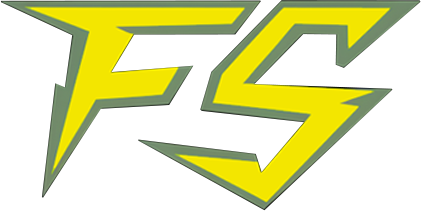

# FanSpark - Web3 Creator Economy Platform

<div align="center">
  
  
  
  **FanSpark is a next-generation crowdfunding and commerce platform built for creators, publishers, and fans. Powered by Flow Blockchain**
  
  [](https://nextjs.org/)
  [](https://reactjs.org/)
  [](https://tailwindcss.com/)
  [](https://dynamic.xyz/)
  [](https://docs.ethers.io/)

</div>

---

## About FanSpark

**FanSpark** is a next-generation crowdfunding platform that helps artists, publishers, and creators bring their ideas to life with the support of their fans.

### Our Mission

To bridge the gap between creators and fans through a seamless, user-friendly platform that empowers creators to fund ideas, build communities, and reward supporters with physical and digital collectibles that carry real connection and value.

### What Makes FanSpark Special

- **Creator-First**: Built specifically for creators, artists, old and new IPs
- **Built on Mainnet Flow EVM**: Powering the next wave of consumer-friendly blockchain apps. Deployed on: https://evm.flowscan.io/address/0x87238F9D7da480f268DeaB34906A2235a520593D
- **Gamified Experience**: Integrated campaigns, quests, gacha systems, and interactive features
- **True Ownership**: Digital collectibles with verified on-chain authenticity
- **Global Community**: Connect with fans globaly

---

## Featured Campaigns

### Stellar Ardent - Issue #1: The Stellar Comet

> *"The Stellar Comet is the first issue in a brand-new sci-fi fantasy comic series set on a reimagined Mars: a lush, mysterious world where ancient magic collides with cosmic destiny."*

**Active Campaign** featuring digital comic books and exclusive collectibles from the Stellar Ardent universe.

### More Creator Partnerships

- **The Legend of New Shaolin** - Black Salt spin-off by Ratti Entertainment
- **GONGORA** - Epic graphic novel by Flamewrite Entertainment  
- **The Aurora Evolution** - Interactive motion comic series by Space Labs

---

## Key Features

### **Wallet & Authentication**
- **Multi-Wallet Support**: MetaMask, WalletConnect, Coinbase Wallet, and more via Dynamic.xyz
- **Seamless Onboarding**: Easy wallet connection with guided setup

### **Minting & Commerce**
- **Individual Minting**: Mint single reward tiers with real-time price display
- **Batch Minting**: Add multiple items to cart and mint in sequence
- **Whitelist Support**: Priority access with Merkle proof verification
- **Dynamic Pricing**: Support for public and whitelist pricing tiers
- **Shopping Cart**: Intuitive cart system with quantity management

### **NFT Management**
- **Multi-token Standard**: Smart contract support for multiple digital collectibles
- **Real-time Supply Tracking**: Live minted/remaining counts
- **Metadata Display**: High-quality images and detailed NFT information
- **Progress Tracking**: Visual progress bars for campaign goals

### **User Experience**
- **Fully Responsive**: Optimized for desktop, tablet, and mobile
- **Dark Mode**: Modern dark theme with custom accent colors
- **Real-time Updates**: Live contract data synchronization
- **Error Handling**: User-friendly error messages and retry logic
- **Toast Notifications**: Clear feedback for all user actions

### **Gamification (Coming Soon)**
- **Gacha System**: "Spark of Luck" - Collection-specific gacha mechanics
- **Battery Game**: "Restore Power!" - Energy management gameplay
- **Quest System**: Missions and achievements

---

## Technical Architecture

### **Frontend Stack**
- **Framework**: Next.js 15.2 (App Router)
- **UI Library**: React 19.0 with Hooks
- **Styling**: Tailwind CSS 4.0 + shadcn/ui components
- **Icons**: Lucide React
- **Animations**: Framer Motion

### **Web3 Integration**
- **Web3 Library**: Ethers.js 5.7.2
- **Wallet Provider**: Dynamic.xyz SDK
- **Smart Contracts**: Multi-token standard support
- **Network Layer**: Viem 2.31 for wallet client operations

### **State Management**
- **Global State**: React Context API
- **Local Persistence**: LocalForage for cart and preferences
- **Real-time Sync**: Custom hooks for contract data

### **Development Tools**
- **TypeScript**: Type-safe development
- **ESLint**: Code quality and consistency
- **Environment Variables**: Secure configuration management

---

## Quick Start

### Prerequisites

- Node.js 18.x or higher
- npm, yarn, or pnpm package manager
- Web3 wallet (MetaMask recommended)

### Installation

1. **Clone the repository**
   ```bash
   git clone https://github.com/your-org/fanspark-ui-minter-app.git
   cd fanspark-ui-minter-app
   ```

2. **Install dependencies**
   ```bash
   npm install
   # or
   yarn install
   ```

3. **Configure environment variables**
   ```bash
   cp .env.local.example .env.local
   ```
   
   Edit `.env.local` with your configuration:
   ```env
   # Network Configuration
   NEXT_PUBLIC_CHAIN_ID=your_chain_id
   NEXT_PUBLIC_NETWORK_NAME=your-network
   NEXT_PUBLIC_NETWORK_DISPLAY_NAME=Your Network Name
   NEXT_PUBLIC_RPC_URL=your_rpc_url
   NEXT_PUBLIC_BLOCK_EXPLORER_URL=your_explorer_url
   
   # Contract Configuration
   NEXT_PUBLIC_CONTRACT_ADDRESS=0x...
   
   # Brand Configuration
   NEXT_PUBLIC_BRAND_NAME=FanSpark
   NEXT_PUBLIC_BRAND_URL=https://www.fanspark.xyz
   
   # Dynamic.xyz Configuration
   NEXT_PUBLIC_DYNAMIC_ENVIRONMENT_ID=your_dynamic_environment_id
   ```

4. **Fetch contract data** (optional, for live contract data)
   ```bash
   npm run fetch-contract-data
   ```

5. **Start development server**
   ```bash
   npm run dev
   ```

6. **Open your browser**
   ```
   http://localhost:3000
   ```

---

## Available Scripts

| Command | Description |
|---------|-------------|
| `npm run dev` | Start development server with Turbopack |
| `npm run build` | Build for production |
| `npm run start` | Start production server |
| `npm run lint` | Run ESLint for code quality |
| `npm run fetch-contract-data` | Fetch latest contract data from network |
| `npm run test-whitelist` | Test whitelist Merkle proof functionality |
| `npm run test-agents` | Test AI agents API integration |
| `npm run setup-env` | Interactive environment setup |
| `npm run generate-webhook` | Generate webhook signatures |

---

## Configuration

### Network Configuration

FanSpark is built on Flow EVM. Smart contract: 0x87238F9D7da480f268DeaB34906A2235a520593D

### Adding New Collections

1. **Create metadata directory**
   ```bash
   mkdir -p public/metadata/[collection-name]/images
   ```

2. **Add metadata files**
   - Create JSON metadata files: `0.json`, `1.json`, etc.
   - Add corresponding images: `0.png`, `1.png`, etc.

3. **Update campaigns configuration**
   Edit `src/data/campaigns.js` to add your new collection

4. **Fetch contract data**
   ```bash
   node scripts/fetch-contract-data.js [collection-name]
   ```

---

## Project Structure

```
fanspark-ui-minter-app/
├── public/                      # Static assets
│   ├── metadata/                # NFT metadata and images
│   ├── character/               # Character assets
│   └── *.png                    # Campaign banners and logos
├── src/
│   ├── app/                     # Next.js app directory
│   │   ├── api/                 # API routes
│   │   │   ├── agents/          # AI agents endpoints
│   │   │   ├── whitelist/       # Whitelist verification
│   │   │   └── dreamnet/        # Webhook handlers
│   │   ├── campaigns/           # Campaign pages
│   │   ├── collections/         # Collection pages
│   │   ├── home/                # Home page
│   │   └── portal/              # User portal
│   ├── components/              # React components
│   │   ├── common/              # Shared components
│   │   ├── campaigns/           # Campaign-specific
│   │   ├── collections/         # Collection-specific
│   │   └── ui/                  # shadcn/ui components
│   ├── data/                    # Static data and configs
│   │   ├── campaigns.js         # Campaign definitions
│   │   ├── collections.js       # Collection definitions
│   │   └── globalSystems.js     # Global system configs
│   ├── hooks/                   # Custom React hooks
│   │   ├── useContractData.js   # Contract data fetching
│   │   ├── useDynamicWallet.js  # Wallet integration
│   │   └── useContractDataSync.js # Real-time sync
│   ├── lib/                     # Utility libraries
│   │   ├── agents-api.js        # AI agents client
│   │   ├── dynamic-config.js    # Dynamic.xyz config
│   │   ├── networks.js          # Network definitions
│   │   └── utils.js             # General utilities
│   └── utils/                   # Additional utilities
│       ├── contractABI.json     # Smart contract ABI
│       └── networkConfig.js     # Network configuration
├── scripts/                     # Utility scripts
│   ├── fetch-contract-data.js   # Contract data fetcher
│   ├── test-whitelist.js        # Whitelist testing
│   └── test-agents-api.js       # API testing
└── docs/                        # Documentation
    ├── CACHING_SETUP.md         # Caching guide
    ├── DYNAMIC_SETUP.md         # Dynamic.xyz setup
    └── ENVIRONMENT_VARIABLES.md # Environment config
```

---

## Whitelist & Merkle Proofs

FanSpark implements secure, gas-efficient whitelist verification using Merkle trees.

### How It Works

1. **Merkle Tree Generation**: Whitelist addresses are hashed into a Merkle tree
2. **Root Storage**: The Merkle root is stored on-chain in the smart contract
3. **Proof Verification**: Users provide a Merkle proof when minting
4. **On-chain Validation**: Contract verifies proof against stored root

### Smart Contract Integration

The `mintWhitelist` function accepts:
- `tokenId`: ID of the token to mint
- `amount`: Quantity to mint
- `merkleProof`: Array of bytes32 proof values
- `receiver`: Recipient address

### Testing Whitelist

```bash
npm run test-whitelist
```

---

## Deployment

### Vercel (Recommended)

1. **Connect your repository** to Vercel
2. **Configure environment variables** in Vercel dashboard
3. **Deploy** - Automatic deployments on push to main

### Alternative Platforms

FanSpark is compatible with any platform supporting Next.js:
- **Netlify**: Use `next export` for static export
- **AWS Amplify**: Deploy via GitHub integration
- **DigitalOcean App Platform**: Docker-based deployment
- **Self-hosted**: Use `npm run build` && `npm run start`

### Build for Production

```bash
npm run build
npm run start
```

---

## Contributing

We welcome contributions from the community! Here's how you can help:

1. **Fork the repository**
2. **Create a feature branch**
   ```bash
   git checkout -b feature/amazing-feature
   ```
3. **Make your changes** and commit
   ```bash
   git commit -m "Add amazing feature"
   ```
4. **Push to your branch**
   ```bash
   git push origin feature/amazing-feature
   ```
5. **Open a Pull Request**

### Development Guidelines

- Follow existing code style and conventions
- Write clear commit messages
- Test thoroughly before submitting
- Update documentation as needed
- Ensure all linter checks pass

---

## License

This project is licensed under the **MIT License** - see the [LICENSE](LICENSE) file for details.

---

## Links & Resources

- **Website**: [https://www.fanspark.xyz](https://www.fanspark.xyz)
- **Documentation**: [docs/](./docs/)
- **Support**: [support@fanspark.xyz](mailto:support@fanspark.xyz)
- **Twitter**: [@FanSparkXYZ](https://twitter.com/FanSparkXYZ)
- **Discord**: [Join our community](https://discord.gg/fanspark)

---

## Acknowledgments

Built by the FanSpark team and powered by:

- [Next.js](https://nextjs.org/) - React framework
- [Dynamic.xyz](https://dynamic.xyz/) - Web3 authentication
- [Ethers.js](https://docs.ethers.io/) - Web3 library
- [Tailwind CSS](https://tailwindcss.com/) - CSS framework
- [shadcn/ui](https://ui.shadcn.com/) - UI components

---

<div align="center">
  
  **Spark your creativity with FanSpark**
  
  Made by creators, for creators
  
</div>
